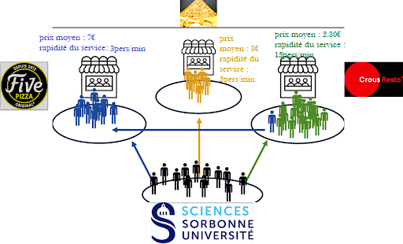
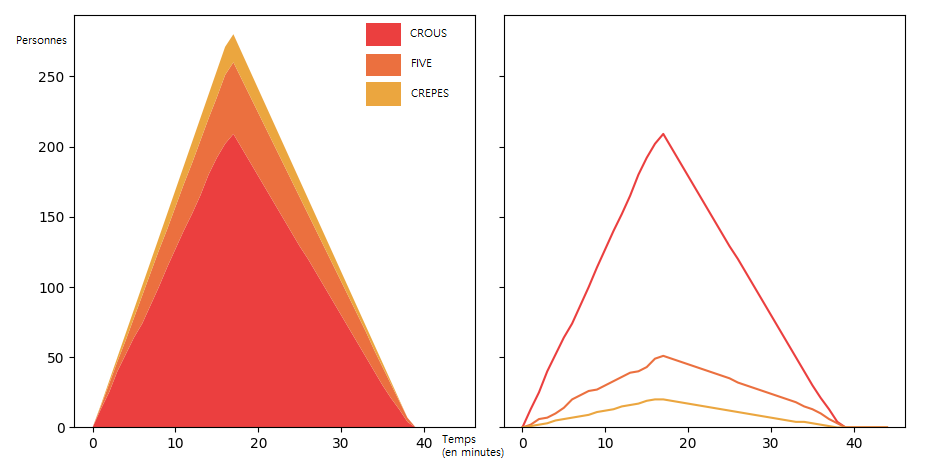

# Optimisation des restaurants de Jussieu

Ce projet consiste à mener une analyse approfondie en utilisant un modèle Python pour étudier les schémas de fréquentation des restaurants autour de la région de Jussieu. En tirant parti des capacités d'analyse des données de Python, le projet vise à découvrir des aperçus sur les facteurs influençant la popularité des restaurants, tels que le prix,les types de cuisine, la proximité avec d'autres établissements ainsi que le budget de chacun. Grâce à la collecte, au nettoyage et à l'analyse des données, le modèle aidera à identifier les tendances et les schémas dans le comportement des clients, fournissant ainsi des aperçus précieux aux propriétaires de restaurants, aux entreprises locales et aux urbanistes intéressés par l'optimisation de l'expérience culinaire et de l'activité économique dans les environs de Jussieu.

  

## Présentation de l'équipe

|(´・ω・｀)| ( ͡° ͜ʖ ͡°) | ಠ_ಠ | (▀̿Ĺ̯▀̿ ̿) |
|-----|--|--|--|
| F. Lopez| L. Bresson | N. Alam  | M. Lahboubi  |

## Description synthétique du projet

**Problématique :**
Comment ameliorer le crous de Jussieu?

**Hypothèse principale :**
Y a-t-il une corrélation entre le prix des repas proposés par un restaurant et son attrait pour les clients ?

**Objectifs :**
Évaluer la satisfaction globale des clients à l'égard des différents restaurants de Jussieu.

## Présentation structurée des résultats

Dans le cadre de ce projet d'analyse des schémas de fréquentation des restaurants autour de la région de Jussieu, nous avons développé un modèle en utilisant Python pour examiner les tendances et les facteurs influençant la popularité des restaurants. Voici un aperçu des principaux points à considérer :

**Choix de modélisation :** Nous avons opté pour une modélisation orientée objet en utilisant des classes Python pour représenter les clients et les restaurants. Cela nous a permis de créer une architecture flexible et extensible pour notre simulation. Les méthodes définies dans les classes permettent de calculer l'attrait des restaurants en fonction de divers critères tels que le prix, la file d'attente, la distance et les préférences des clients. Les paramètres de simulation sont ajustables, ce qui nous permet de contrôler différents aspects du modèle pour des analyses approfondies.

**Outils et code :** Nous avons utilisé des bibliothèques Python telles que NumPy, Matplotlib pour le traitement des données, la visualisation et la gestion des fichiers. Le code est bien structuré, facilitant ainsi sa compréhension et sa maintenance. Il est divisé en deux parties : la première définit les classes et les fonctions pour la simulation, tandis que la deuxième exécute la simulation, collecte les données et trace les résultats.

**Quelques graphes :**

  

Graphes montrant les files d'attente des différents restaurants en fonction du temps (les courbes du premier graphe étant superposées)   

Graphes montrant l'évolution d'une simulation en fonction du temps (les courbes du premier graphe étant superposées)

## Conclusion et Analyse Critique

En conclusion, notre projet d'analyse des schémas de fréquentation des restaurants autour de la région de Jussieu nous a permis de développer un modèle basé sur Python. Ce modèle offre des perspectives précieuses sur les tendances de fréquentation et fournit des recommandations utiles pour les propriétaires de restaurants et les décideurs locaux.Dautre part notre code se focalise sur le comportement individuel des clients plutôt que sur les mouvements de groupe, simplifiant ainsi la simulation. Cependant, cette approche peut négliger la réalité des files d'attente dans les restaurants de Jussieu, où les clients se déplacent souvent en groupe. Cette limite doit être prise en compte lors de l'analyse des résultats de la simulation.
Pour accroître la pertinence et la précision de notre simulation, nous envisageons l'intégration de facteurs externes tels que des tendances de fréquentation spécifiques à chaque jour de la semaine, les périodes de vacances ou les événements spéciaux. De même, en anticipant les périodes de vacances scolaires, les restaurants pourraient adapter le niveau de personnel et les capacités d'accueil pour répondre à une demande plus basse. Une analyse plus approfondie des résultats et une validation supplémentaire du modèle pourraient également être bénéfiques pour garantir sa pertinence et sa précision dans des contextes réels.

## Bibliographie :

